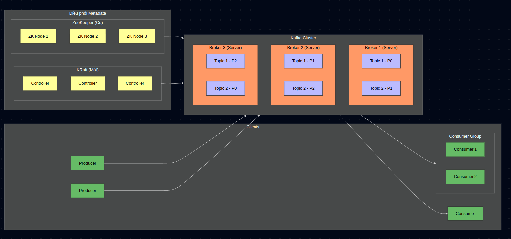

### kafka architecture
- Kafka là một hệ thống message broker phân tán, stream data mạnh mẽ
- kiến trúc của kafka:

Mô tả:
1. Kafka Broker:
  - là một server trong kafka cluster. một kafka cluster có thể gồm một hoặc nhiều broker.
  - mỗi broker quản lí một phần dữ liệu của kafka cluster và giao tieps với các broker khác để đồng bộ và phân phối dữ liệu
  - các broker trong một cluster chia sẻ thông tin và topic, partition và metadata
  - khi một producer gửi message đến kafka, broker sẽ nhận và lưu trữ các message đó trong một topic tương ứng

2. Kafka Producer
  - là các ứng dụng hoặc services gửi message vào kafka
  - producer xác định thông tin về message, bao gồm topic và (tùy chọn) key cho mỗi message
  producer có thể hoạt động đồng bộ hoặc không đồng bộ khi gửi message đến kafka

3. Kafka Consumer:
  - là các ứng dụng hoặc services nhận message từ kafka
  - một consumer có thể tham gia vào một hoặc nhiều consumer group
  - khi nhiều consumer chia sẻ cùng một consumer group, các message trong topic sẽ được phân phối đến các consumer theo partition (mỗi partition sẽ chỉ được một consumer trong group xử lí)
  - consumer có thể theo dõi trạng thái offset để biết nó đã đọc đén đâu

4. Kafka Topics
  - topic là đơn vị tổ chức chính trong kafka (về mặt logic), nơi các message được ghi và đọc.
  - mỗi topic có thể có một hoặc nhiều partition
  - topic là một kênh để producer gửi message và consumer nhận message

5. Kafka Partitions
  - là đơn vị phân tán dữ liệu trong kafka (đơn vị lưu trữ vật lí)
  - các partition cho phép kafka phân phối tải giữa các broker trong cluster
  - mỗi partition có thể có nhiều replicas để đảm bảo tính sẵn sàng và độ bền

6. Điều phối metadata
  * Zookeeper:
    - được dùng để quản lí metadata của kafka cluster (như thông tin về broker, topic, partition)
    - chịu trách nhiệm về việc đông bộ hóa và chọn leader cho partition
    - đã loại bỏ trong kafka 4.0
  * Kraft mode (kafka raft metadata mode):
    - sử dụng để thay thế zookeeper (vì zookeeper cần cài đặt riêng)
    - thử nghiệm ở phiên bản kafka 2.8, phiên bản ổn định đầu tiên là 3.3
