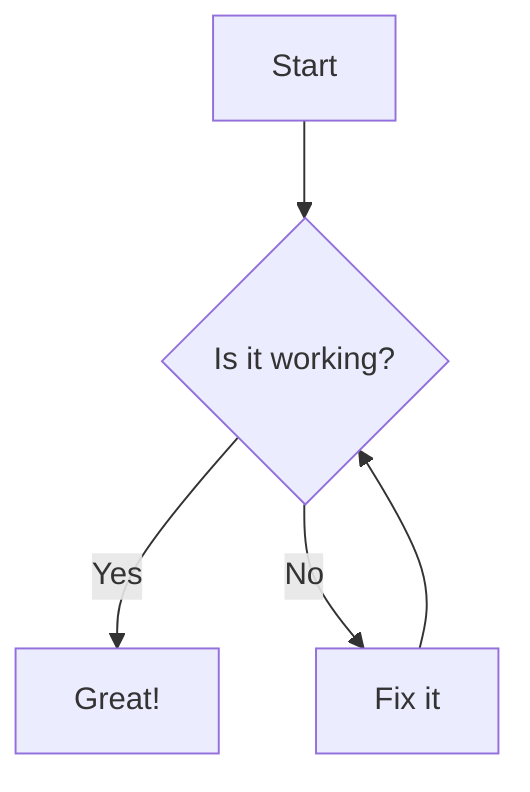

```
  Sign Up
    ├── Client
    │   └── Gửi thông tin đăng ký: username, email, password
    └── Server
        ├── Nhận yêu cầu
        ├── Kiểm tra hợp lệ dữ liệu
        └── Kiểm tra username/email đã tồn tại?
            ├── Có: Trả về lỗi: Username/Email đã tồn tại
            └── Không:
                 ├── hash mật khẩu và lưu vào DB
                 └── Trả về response thành công
```
test mermaid trên github

